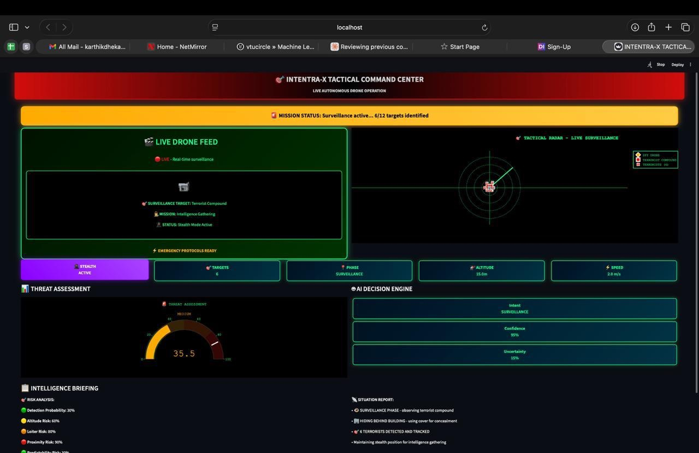
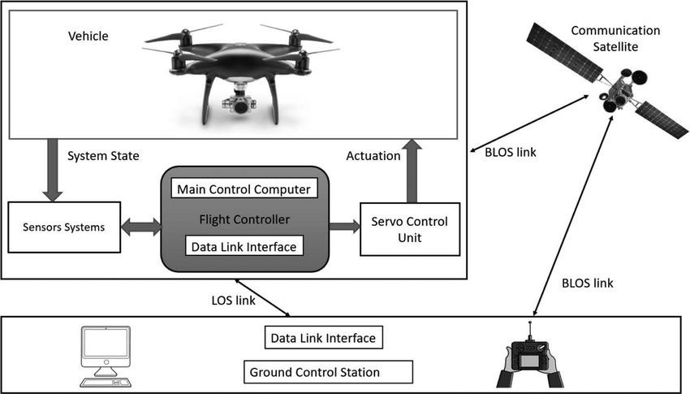
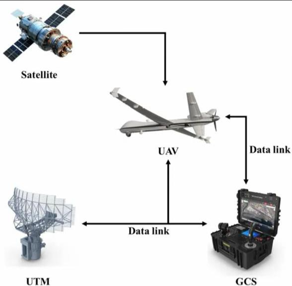
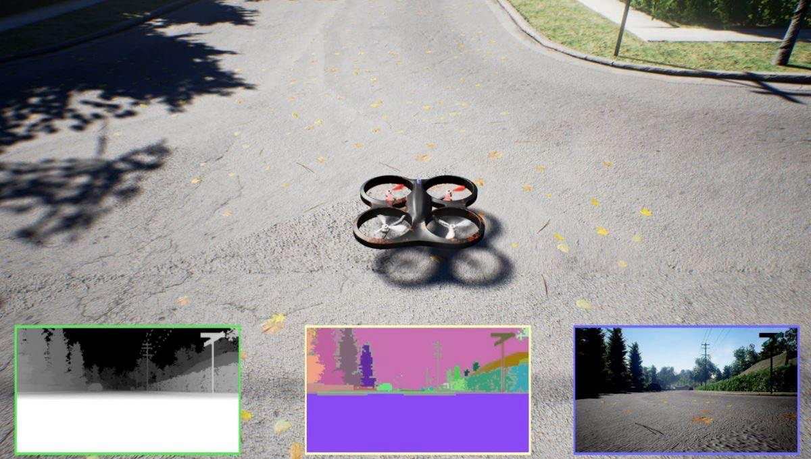
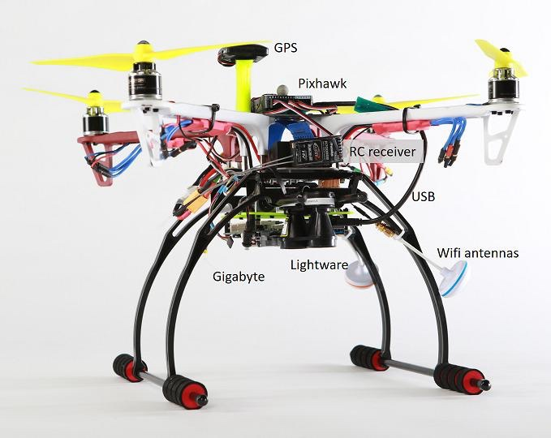

<div align="center">

# EPIDIA
### Cognitive Intelligence Platform for Autonomous Drones

*"Autonomy begins with awareness."*

[](https://python.org)
[](https://tensorflow.org)
[](https://epidia-cognitive-airspace.vercel.app)
[](LICENSE)
[](https://vtu.ac.in)

**🏆 Top 15 | MakeForBelagavi Makeathon | 300+ Teams | VTU Headquarters**

[Live Demo](https://epidia-intentra-x.streamlit.app) · [Pitch Deck](./pitch_deck_ssk_.pdf) · [Report Bug](https://github.com/karthikdhekane-cpu/Cognitive-airspace-/issues)

</div>

---

## What is EPIDIA?

EPIDIA is **India's first cognitive intelligence platform** that enables autonomous drones to understand intent, assess risk, and make explainable decisions in real time.

Unlike existing drone autopilots that only handle navigation, EPIDIA adds a **behavioral intelligence layer** — giving drones the ability to *reason* about what they're doing and *why*, while staying fully compliant with DGCA regulations.

---

## Live Dashboard — INTENTRA-X Tactical Command Center



The INTENTRA-X dashboard provides real-time cognitive intelligence for autonomous drone operations:

- **Live Drone Feed** with mission status and target tracking
- **Tactical Radar** showing live surveillance zones
- **AI Decision Engine** — Intent · Confidence · Uncertainty scores per frame
- **Threat Assessment** gauge with multi-factor risk breakdown (Detection · Altitude · Loiter · Proximity)
- **Intelligence Briefing** with auto-generated situation reports

---

## System Architecture

### Flight Control Architecture


EPIDIA's cognitive layer sits between the Flight Controller and Ground Control Station, intercepting telemetry to classify behavior and score risk before any actuation decision is made.

### UAV Communication System


The platform supports both **LOS (Line-of-Sight)** and **BLOS (Beyond Line-of-Sight)** communication via satellite uplinks, integrated with UTM (Unmanned Traffic Management) infrastructure.

### AirSim Simulation Environment


EPIDIA was trained and validated using **Microsoft AirSim** — providing photorealistic simulation with depth maps, semantic segmentation, and RGB camera feeds for behavioral model training.

### Hardware Compatibility


Platform-agnostic design — integrates with **Pixhawk flight controllers**, GPS modules, RC receivers, and WiFi/telemetry antenna systems across DJI, PX4, and ArduPilot hardware ecosystems.

---

## The Problem

India's ₹30,000 Crore drone revolution is stalled by a **cognitive intelligence gap**:

| Problem | Impact |
|---|---|
| Border forces can't distinguish friendly vs threat drones | National security risk |
| Defense operations without behavioral reasoning | 60% false alarm rate |
| Agricultural drones with non-adaptive flight paths | 15–20% efficiency loss |
| DGCA can't certify black-box AI systems | Market deployment blocked |
| Only 5–8% of operators have BVLOS certification | ₹25,000 Cr untapped market |

---

## Solution

EPIDIA integrates three core AI systems into a single, DGCA-compliant platform:

```
Flight Data → LSTM Behavioral Engine → Risk Scorer → XAI Dashboard → Operator
                     ↓                      ↓
             Intent Classification    Uncertainty Flag
             (87% accuracy)          (Human Oversight)
```

### Core Modules

**1. LSTM Behavioral Intelligence**
- Classifies drone operational intent from real-time motion patterns
- Identifies: `Transit` | `Surveillance` | `Evasive` behaviors
- 87% classification accuracy on flight telemetry data

**2. Probabilistic Risk Assessment Engine**
- Multi-factor exposure scoring: Altitude · Proximity · Loiter Time · Field-of-View
- Real-time risk score output: `0–100%` with per-factor breakdown
- 42% safer operation vs standard autopilot systems

**3. Uncertainty Quantification**
- Entropy-based confidence metrics on every autonomous decision
- Automatically flags ambiguous situations for human review
- Prevents overconfident AI errors in edge cases

**4. Explainable AI (XAI) Dashboard**
- Complete audit trails with state transition logs
- DGCA Type Certification ready — transparent, auditable decisions
- Post-mission risk summaries for regulatory compliance reporting

---

## Tech Stack

| Layer | Technology |
|---|---|
| Behavioral AI | LSTM Neural Networks (TensorFlow/Keras) |
| Risk Modeling | Probabilistic Engine (NumPy, SciPy) |
| Uncertainty | Entropy-based confidence scoring |
| Simulation | Microsoft AirSim |
| Dashboard | React + Vercel |
| Hardware | Pixhawk · DJI · PX4 · ArduPilot |

---

## Key Features

- ✅ **Platform-Agnostic** — works with existing drone hardware, no replacement needed
- ✅ **DGCA Drone Rules 2021** compliant architecture
- ✅ **Digital Sky Platform** compatible
- ✅ **India-Optimized** — 487 airports, 200+ military no-fly zones pre-loaded
- ✅ **Edge + Cloud** deployment modes
- ✅ **Multi-language support** for Indian operators

---

## Use Cases

| Sector | Application |
|---|---|
| 🛡️ Defense & Border | Threat vs civilian drone classification across 7,516 km border |
| 🏙️ Smart Cities | Coordinated urban drone operations (100+ municipalities) |
| 📦 E-commerce | BVLOS-certified delivery for Flipkart, Amazon, Swiggy |
| 🌾 Agriculture | Adaptive flight paths for 15 Cr farmers |
| ⚡ Infrastructure | Power Grid, Railways inspection with audit trails |

---

## Business Model

**B2B/B2G SaaS** — tiered subscriptions + government contracts

| Plan | Price | Fleet Size |
|---|---|---|
| Starter | $799/month | 10–30 drones |
| Professional | $2,500/month | 30–100 drones |
| Enterprise | Custom | Unlimited |
| Pay-As-You-Go | $1/hr or $7/mission | Any |
| Gov/Defense | $50K–$500K/year | Custom |

---

## Market Opportunity

- 🇮🇳 India drone market: **₹1,200 Cr (2023) → ₹30,000 Cr by 2030** (32% CAGR)
- 🌍 Global autonomous drone AI: **$12.5 billion by 2030**
- 🎯 Immediate addressable: **₹1,000 Crore** (1,000 fleets × ₹10 lakh avg)

---

## Achievements

- 🏆 **Top 15 out of 300+ teams** — MakeForBelagavi Makeathon, VTU Headquarters
- 🚀 **Selected for VTU × InUnity Preincubation Program** with assigned industry mentor
- 🌐 **Live deployment** at [epidia-cognitive-airspace.vercel.app](https://epidia-intentra-x.streamlit.app)

---

## Project Structure

```
Cognitive-airspace-/
├── intentra_x/          # Core LSTM + risk modeling engine
├── docs/                # Architecture diagrams & screenshots
│   ├── dashboard.png    # INTENTRA-X live dashboard
│   ├── architecture.png # Flight controller architecture
│   ├── uav-system.png   # UAV communication system
│   ├── airsim.png       # AirSim simulation environment
│   └── hardware.png     # Hardware compatibility stack
├── find_config.py       # Configuration discovery utility
├── fix_dashboard.py     # Dashboard patching utility
└── README.md
```

---

## Getting Started

```bash
# Clone the repository
git clone https://github.com/karthikdhekane-cpu/Cognitive-airspace-.git
cd Cognitive-airspace-

# Install dependencies
pip install -r requirements.txt

# Run the cognitive engine
cd intentra_x
python main.py
```

---

## Team

**Karthik Dhekane** — Technology Lead  
CS Engineering, KLE Institute of Technology, Hubli (VTU)  
[GitHub](https://github.com/karthikdhekane-cpu) · [LinkedIn](https://linkedin.com/in/karthikdhekane)

📧 karthikdhekane@gmail.com  
📍 Hubli, Karnataka, India

---

## Contact

For partnerships, pilots, or investment inquiries:

📧 hulamanisrinish@gmail.com  
📱 +91 9538826940  
🌐 [epidia-cognitive-airspace.vercel.app](https://epidia-intentra-x.streamlit.app)

---

<div align="center">

*Built with purpose for India's drone revolution.*

**EPIDIA — Autonomy begins with awareness.**

</div>
